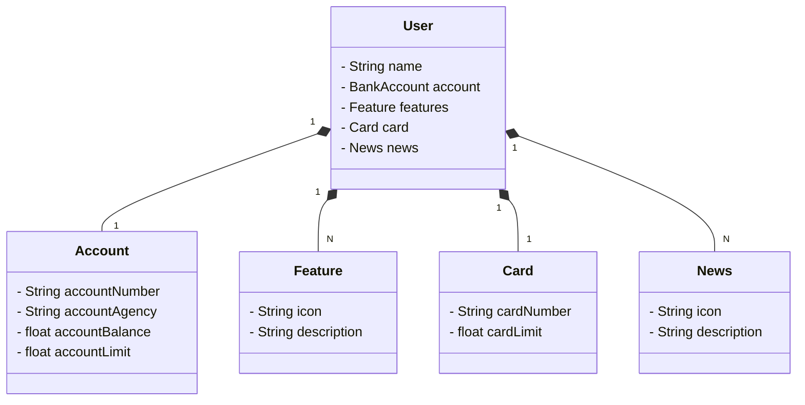

# Bootcamp Santander Backend 2024

## Diagrama de classes

## Banco H2
<a href="http://localhost:8080/h2-console/" target="_blank">Banco H2</a>

## Swagger 
<a href="http://localhost:8080/swagger-ui/index.html"> Swagger</a>
