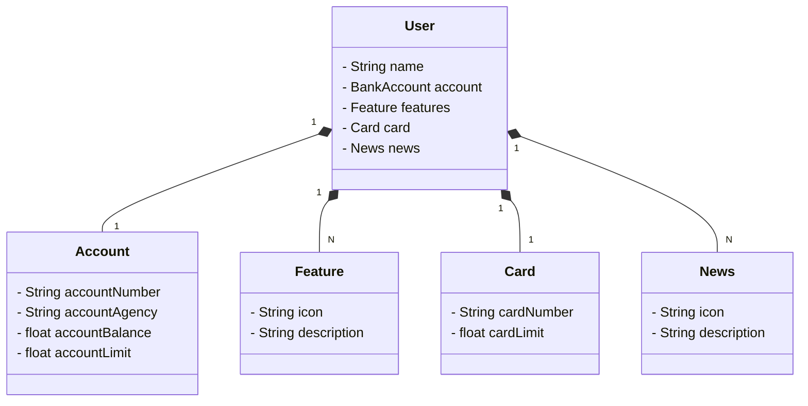

# Bootcamp Santander Backend 2024

## Diagrama de classes

```mermaid  <!--https://mermaid.js.org/ -->
classDiagram
    class User {
        - String name
        - BankAccount account
        - Feature features
        - Card card
        - News news
    }
    
    class Account {
        - String accountNumber
        - String accountAgency
        - float accountBalance
        - float accountLimit
    }
    
    class Feature {
        - String icon
        - String description
    }
    
    class Card {
        - String cardNumber
        - float cardLimit
    }
    
    class News {
        - String icon
        - String description
    }
    
    User"1" *--"1" Account
    User"1" *--"N" Feature
    User"1" *--"1" Card
    User"1" *--"N" News

```

